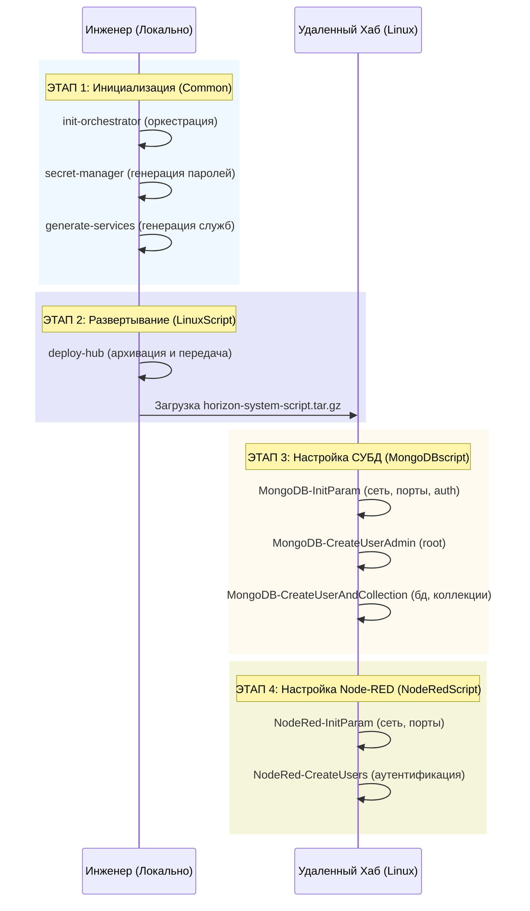

<div align="left">
  <b>ООО "МАС"</b><br />
  <b>Проект:</b> 27/2025-N1-МАС<br />
  <b>Ревизия:</b> rev.04<br />
  <b>Версия:</b> v02<br />
  <b>Дата:</b> 23 июня 2026 г.
</div>
<br />

# DeployScript: скрипты развертывания

Проект содержит системные скрипты и модули для автоматизированного развертывания промышленной платформы **Horizon Automation** на аппаратных хабах (Raspberry Pi CM4/CM5) под управлением Linux.

## Назначение

Обеспечение автоматизированного процесса инициализации, настройки и развертывания всех программных компонентов платформы Horizon Automation:

- **Оркестрация**: Единый процесс генерации паролей и системных служб.
- Генерация и управление systemd-службами Node-RED.
- Инициализация и конфигурирование СУБД MongoDB.
- Настройка среды Node-RED с аутентификацией и синхронизацией.
- Дистанционное развертывание на промышленные хабы через SSH.

---

## Корневая директория

```
HorizonSystemScript/
├── js/           # Исходный код скриптов автоматизации
├── res/          # Ресурсы, конфигурационные файлы, документация
├── sh/           # Вспомогательные системные скрипты
└── README.md     # Этот файл
```

---

## Подробное описание директорий

### 1. `js/app/`

Содержит логику автоматизации, разделенную по компонентам:

- **init-orchestrator.js** - Единая точка входа для генерации паролей и системных служб.
- `01__Common/` - Ядро системы (загрузчик конфигурации, менеджер секретов, генератор служб).
- `02__LinuxScript/` - Управление системными службами и удаленным развертыванием.
- `03__MongoDBscript/` - Инициализация СУБД, управление БД/пользователями.
- `04__NodeRedScript/` - Настройка Node-RED, аутентификация, синхронизация.

### 2. `res/`

#### `01__config/` - Конфигурация

- **settings_ha.json** - Главный файл конфигурации проекта.
- **CREDENTIALS.md** - Отчеты с учетными данными (генерируются автоматически).
- **dbVMPass.csv** - Накопительный архив всех сгенерированных паролей.

#### `02__документация/` - Документация

- Общая документация проекта.

---

## Обзор документации (README)

Для навигации по модулям проекта используйте следующие ссылки:

- [**README-Common**](js/app/01__Common/README-сommon.md) - Объединённая документация модуля Common
- [**README-LinuxScript (Службы)**](js/app/02__LinuxScript/README-LinuxScript.md) - Системные службы и развертывание
- [**README-MongoDBscript (Данные)**](js/app/03__MongoDBscript/README-MongoDBscript.md) - Управление СУБД
- [**README-NodeRedScript (Среда Node-RED)**](js/app/04__NodeRedScript/README-NodeRedScript.md) - Настройка Node-RED
- [**README-Deploy (Развертывание)**](js/app/02__LinuxScript/Deployment/README-deploy.md) - Дистанционное развертывание
- [**README-Settings (Конфигурация)**](res/01__config/README-Settings.md) - Описание настроек

---

## Быстрый старт

### Полная инициализация (основной процесс)

```bash
# Из корневой директории проекта
node js/app/init-orchestrator.js
```

### Дистанционное развертывание

```bash
# Из корневой директории проекта
node js/app/02__LinuxScript/Deployment/deploy-hub.js
```

---

## Архитектура развертывания

Платформа развертывается на 3-х уровнях (трехуровневая архитектура):

- **hubLOW** (Нижний уровень)
- **hubMID** (Средний уровень)
- **hubHI** (Верхний уровень)

Каждый хаб работает как независимый узел (Raspberry Pi CM4/CM5) с собственной конфигурацией (`settings_ha.json`).

---

## Дополнительно

- Все команды выполняются из **корневого каталога проекта**.
- Конфигурация хранится в `res/01__config/settings_ha.json`.
- SSH-доступ к хабам настраивается через `~/.ssh/config`.
- Пароли генерируются динамически `init-orchestrator.js` и архивируются.

---

## Внутренняя архитектура генерации

Ниже представлена мнемосхема того, как выполняется генерация паролей, служб и настройка систем из `settings_ha.json`:


